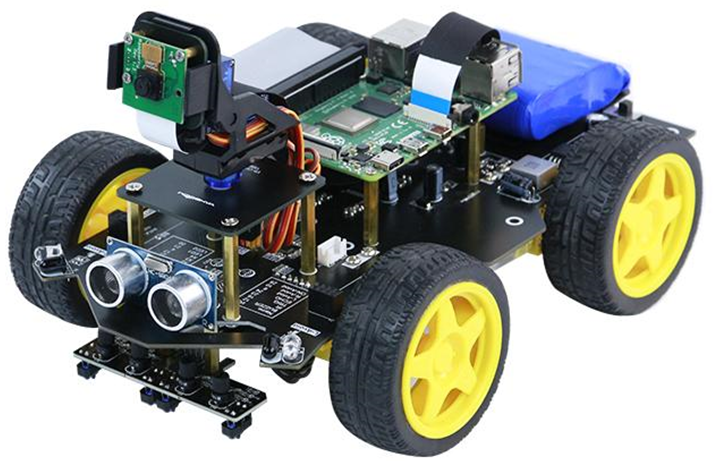
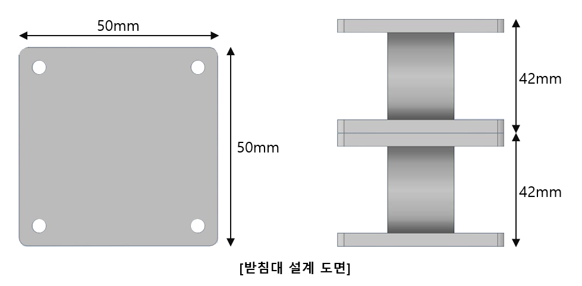
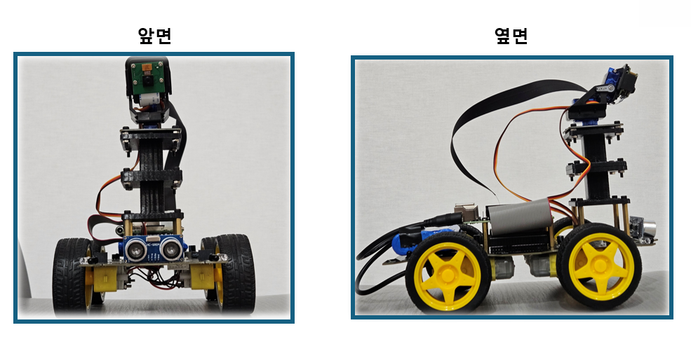
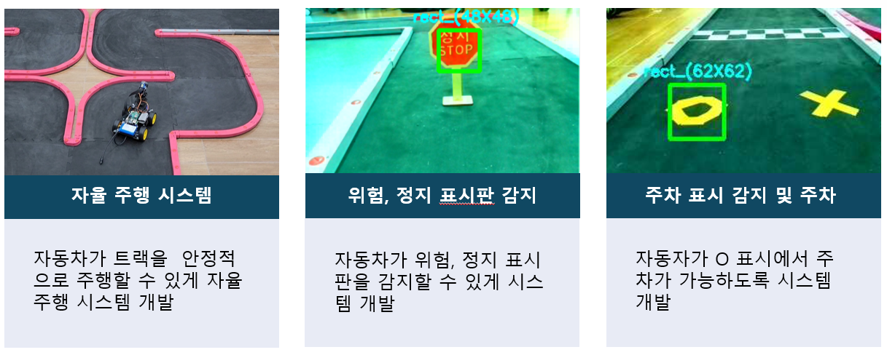

# Autonomous_driving

라즈베리 4를 사용하여 자율주행 자동차를 만들기

    

라즈베리 4와 카메라를 이용해서 자율주행 자동차를 만드는 프로젝트를 진행했다. python기반이며 라이브러리는 opencv, Numpy, Pandas RPI.GPIO를 사용했다. 

 

### 1. 하드웨어 보강
---
위 사진 상태에서 표지판 인식을 하기에는 너무 낮아서 카메라를 올렸다.

  

이런 구조를 가진 카메라 지지대를 3D 프린터로 출력해서 사용했다. 

  

 

### 2. 주행 목표 및 주행 영상
---

<video src="./영상/주행 영상.mp4" controls autoplay loop></video>
  

 

